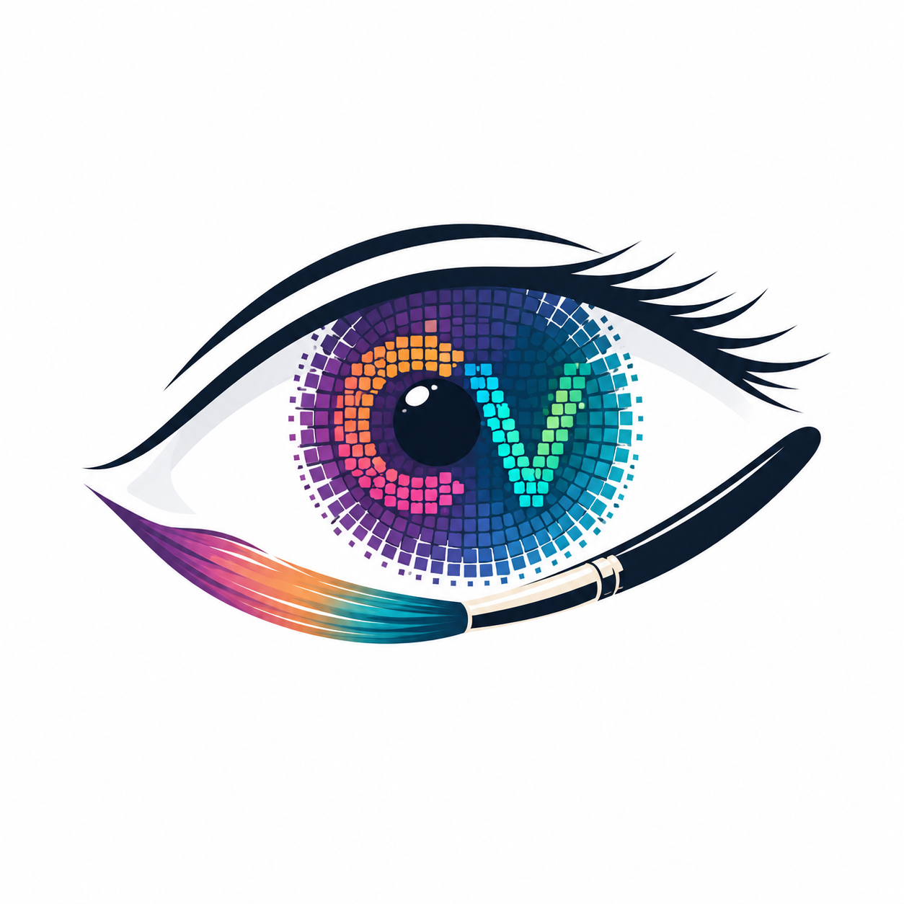

<p align="center">
  
</p>

<h1 align="center">CipherVision</h1>

<p align="center">
  <strong>AI-Powered Invisible Watermarking for Digital Ownership Protection</strong>
</p>

<p align="center">
  Protect digital artwork, photography, and creative assets using deep neural watermarking.
</p>

<p align="center">


</p>

---

## Overview

CipherVision is a full-stack AI-powered web application that enables creators to securely protect and verify ownership of digital images using invisible neural watermarking.

Unlike traditional visible watermarks that can be cropped, edited, or degrade image quality, CipherVision embeds an imperceptible ownership identifier directly into an image using a deep learning model. This identifier can later be extracted to authenticate ownership while preserving the original visual appearance of the image.

The platform combines artificial intelligence, computer vision, secure authentication, cloud databases, and modern web technologies into a complete digital ownership verification system.

## AI Model

CipherVision integrates the **PixelSeal** pretrained deep neural watermarking model for invisible image watermark embedding and extraction.

The model is responsible for embedding an imperceptible ownership payload into an image and recovering it during verification. CipherVision extends this capability by integrating secure ownership management, BCH error correction, Google OAuth authentication, duplicate watermark detection, and a complete web application for digital ownership verification.

## Problem Statement

Digital artwork is shared across the internet at an unprecedented scale, making unauthorized copying, redistribution, and ownership disputes increasingly common.

Conventional watermarking techniques suffer from several limitations:

- Visible watermarks reduce visual quality.
- Watermarks can often be cropped or removed.
- Ownership verification usually depends on external metadata that can be altered or lost.

CipherVision addresses these challenges by embedding ownership information directly into image pixels using deep neural watermarking, enabling reliable ownership verification without affecting image quality.

---

## Features

### AI-Powered Invisible Watermarking
Embeds an invisible ownership identifier into digital images using a deep neural network, with no visible impact on image quality.

### Ownership Verification
Extracts embedded ownership information from protected images and verifies the registered owner against the database.

### Duplicate Watermark Prevention
Before embedding, CipherVision automatically analyzes uploaded images to determine whether they already contain ownership information.

If an existing watermark is detected:
- Duplicate embedding is blocked.
- The original owner is identified.
- Ownership-overwriting attacks are prevented.

### Privacy-Aware Verification
Verification results display:
- Profile picture
- Owner's full name

The registered email address is revealed only when the authenticated owner verifies their own image.

### Secure Authentication
- Google OAuth 2.0
- JWT-based authentication
- Secure HTTP-only cookies
- Protected routes

### Modern User Experience
- Responsive dashboard
- Drag-and-drop image upload
- Upload progress indicators
- Loading animations
- Success and verification modals
- Mobile-friendly interface

---

## Technology Stack

### Backend
- FastAPI
- SQLAlchemy
- PostgreSQL (Neon)
- Jinja2
- Uvicorn

### Authentication
- Google OAuth 2.0
- JWT Authentication
- Secure Cookie Sessions

### Artificial Intelligence
- PyTorch
- PixelSeal Pretrained Neural Watermarking Model
- BCH Error Correction (bchlib)
- OpenCV
- NumPy

### Frontend
- HTML5
- CSS3
- Bootstrap 5
- JavaScript

### Security
- Pillow Image Validation
- File Size Validation
- Duplicate Watermark Detection
- Rate Limiting (SlowAPI)
- Privacy-Aware Verification

---

## System Architecture

```text
                        +----------------------+
                        |     Google OAuth     |
                        +----------+-----------+
                                   |
                                   v
                        +----------------------+
                        |      FastAPI App     |
                        +----------+-----------+
                                   |
            +----------------------+----------------------+
            |                                             |
            v                                             v
+---------------------------+                +---------------------------+
| Authentication Service    |                | Watermark Service         |
| JWT & Session Management  |                | Embed / Verify Pipeline   |
+---------------------------+                +-------------+-------------+
                                                           |
                             +-----------------------------+----------------------------+
                             |                                                          |
                             v                                                          v
                  Neural Watermark Encoder                               Neural Watermark Decoder
                             |                                                          |
                             +-----------------------------+----------------------------+
                                                           |
                                                           v
                                              PostgreSQL (Neon Database)
```

---

## Project Structure

```text
CipherVision/
│
├── app/
│   ├── api/                 # Route handlers
│   ├── auth/                # Google OAuth configuration
│   ├── core/                # Application configuration
│   ├── database/            # Models and CRUD operations
│   ├── services/            # AI watermarking services
│   ├── static/              # CSS, JavaScript, images
│   ├── templates/           # Jinja2 templates
│   └── main.py
│
├── checkpoints/             # Pretrained AI models
├── uploads/                 # Temporary uploaded files
├── outputs/                 # Generated watermarked images
├── scripts/
├── tests/
│
├── requirements.txt
├── .env
└── README.md
```

---

## Core Workflow

```text
                Google Sign-In
                       |
                       v
                User Dashboard
                       |
          +------------+------------+
          |                         |
          v                         v
   Embed Watermark           Verify Ownership
          |                         |
          v                         v
Duplicate Watermark         Decode Watermark
      Detection                    |
          |                        v
          v                 BCH Error Correction
Generate Owner ID                  |
          |                        v
          v                 Retrieve Owner Details
Neural Watermarking                |
          |                        v
          v                 Display Verification
 Download Protected Image
```

---

## Installation and Setup

### Prerequisites
- Python 3.11+
- PostgreSQL database (or a Neon account)
- Google Cloud project with OAuth 2.0 credentials

### Steps

```bash
# Clone the repository
git clone https://github.com/<your-username>/CipherVision.git
cd CipherVision

# Create and activate a virtual environment
python -m venv venv
source venv/bin/activate      # On Windows: venv\Scripts\activate

# Install dependencies
pip install -r requirements.txt

# Configure environment variables
cp .env.example .env
# Fill in DATABASE_URL, GOOGLE_CLIENT_ID, GOOGLE_CLIENT_SECRET, JWT_SECRET, etc.

# Run database migrations (if applicable)
alembic upgrade head

# Start the application
uvicorn app.main:app --reload
```

The application will be available at `http://localhost:8000`.

---

## API Endpoints

| Method | Endpoint | Description |
|---|---|---|
| GET | `/auth/login` | Redirects to Google OAuth consent screen |
| GET | `/auth/callback` | Handles OAuth callback and issues JWT session |
| POST | `/auth/logout` | Clears session and logs the user out |
| POST | `/watermark/embed` | Uploads and embeds a watermark into an image |
| POST | `/watermark/verify` | Uploads an image and verifies embedded ownership |
| GET | `/dashboard` | Returns the authenticated user's dashboard |
| GET | `/user/profile` | Returns the current authenticated user's profile |

---

## Database Schema (Overview)

```text
Users
------------------
id (PK)
name
email
profile_picture_url
created_at

Watermarks
------------------
id (PK)
owner_id (FK -> Users.id)
ownership_id (16-char identifier)
bch_encoded_payload
created_at
```

---

## Security Considerations

- All uploaded images pass extension, MIME type, and Pillow-based validation before processing.
- File size limits are enforced to prevent abuse.
- SlowAPI rate limiting protects endpoints from brute-force and abuse patterns.
- Sessions use secure, HTTP-only cookies in production.
- Ownership data is disclosed under strict privacy rules: only name and profile picture are shown to third parties; email is revealed only to the verified owner.
- Duplicate watermark detection prevents ownership-overwriting attacks.

---

## Future Enhancements

- Improve neural watermark robustness against aggressive compression and cropping
- Add batch upload and bulk verification
- Support video watermarking in addition to images
- Add API key access for programmatic/third-party integrations
- Add key rotation and revocation for ownership identifiers

---

## Acknowledgements

CipherVision uses the pretrained **PixelSeal** neural watermarking model for invisible watermark embedding and extraction.

We acknowledge the authors of PixelSeal for their contribution to neural image watermarking research.
